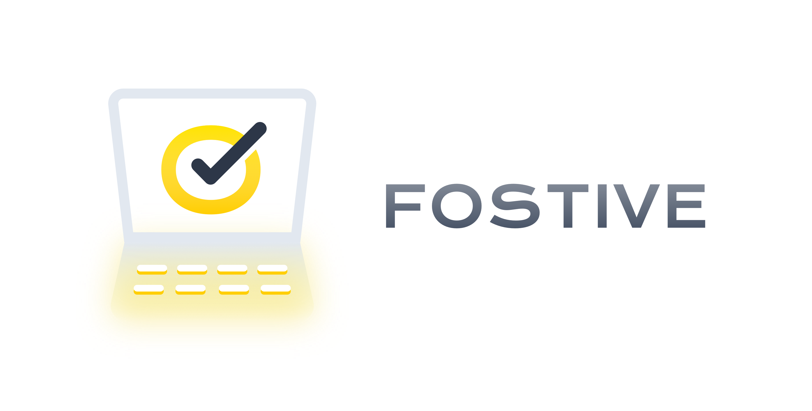

# What is FOSTIVE

FOSTIVE stands for Free and Open Source Tools for Incredible Virtual Events, and it is just that! For many of us, virtual developer events have left us unfulfilled compared to in-person events. Let's use our collective skills to make virtual events (from small meetups to large conferences) more fun, engaging, and fulfilling for organizers, presenters, and attendees.

FOSTIVE was started by the Salesforce Developer Relations team and launched at [CascadiaJS 2020](https://2020.cascadiajs.com).

## Why FOSTIVE

In-person developer events are beneficial for so many reasons -- knowledge sharing, creating new connections in the community, strengthening existing connections, creating friendships, providing the opportunity for inspiring hallway conversations, helping people get new jobs, sharing new product announcements, finding new tools, and many other purposes. And they’re beneficial for people in many different stages of life / career -- new developers, old developers, those wanting to learn a new tool, those wanting to advertise their product or service, those wanting to explore new products or services, job seekers, recruiters, and hiring managers.

However, events have changed in 2020. The COVID-19 pandemic has significantly changed how we can get together as a community. No longer can we get on a plane or take a roadtrip to meet with our peers in-person to discuss topics of mutual interest and learn about all the exciting things going on in our slice of the technology world. Now, we must meet virtually.

But the virtual event experience so far for many of us has been unsatisfying. Attendees no longer have a shared community experience with other attendees and speakers; they have an individual, sometimes lonely, and often distracted experience in front of their computer at home.

**Let’s help to change that. This project aims to improve the virtual event experience. We want to make virtual developer events more fun, more engaging, and more satisfying for attendees, speakers, and organizers.**

## How to use FOSTIVE

### As an event organizer

The [fostive GitHub organization](https://www.github.com/fostive) contains several open source repos which are tools  you can freely use to improve your virtual event. For example, there is

* A [**real-time presentation feedback widget**](https://github.com/fostive/emote-server) allowing attendees to clap, love, raise a hand, agree, and question what's currently being presented.
* An **audience quiz app** allowing a speaker to incorporate a quiz or other questions into their talk that the audience can respond to in real-time.
* A **virtual video booth GIF creator** allowing attendees to create short animated GIFs they can share in different ways: as an introduction for themselves in the event Slack, to share on a social network, or just to keep as a momento reminding them of the great event.

### As a software developer

Help make FOSTIVE better! Many hands make light work.

* Fix bugs
* Add requested features to existing repoos
* Create a new tool in a new repo based on one of the ideas in the unimplemented ideas list
* Write / improve docs

## Questions?

If you have any questions for us, please create a GitHub issue in this repo. We plan to create an FAQ with common questions in the future.

## Contributors

TODO
